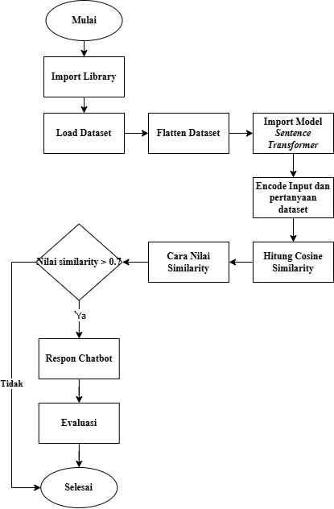

# Pengembangan Model Text Generation dengan Transformer untuk Pemantauan dan Edukasi HIV/AIDS  

## 1. **DATASET**  

[datasetDL.json](https://github.com/user-attachments/files/17963940/datasetDL.json) 
merupakan struktur data berbasis JSON yang dirancang untuk menyimpan informasi tentang berbagai aspek terkait HIV/AIDS. Berikut adalah rincian strukturnya:  

### **1.1. Pengelompokan Berdasarkan Intent (Tujuan)**  
Dataset dikelompokkan berdasarkan beberapa kategori *intent* untuk mengorganisir pertanyaan dan jawaban sesuai topik, meliputi:  
- **Informasi Dasar**  
- **Pencegahan**  
- **Dampak**  
- **Diagnostik**  
- **Perjalanan Infeksi**  
- **Pengobatan**  
- **Penularan**  
- **Epidemiologi**  
- **Edukasi dan Kesadaran Masyarakat**  
- **Isu dan Kebijakan Terkait HIV**  
- **Pengetahuan Dasar Biologi Terkait HIV**  
- **Terminologi Umum HIV**  
- **Teknologi dan HIV**  
- **Faktor Non-Medis dalam Penularan dan Pencegahan**  
- **Hak Pasien HIV/AIDS**  
- **Teknologi dan Inovasi dalam Penanganan HIV**  

### **1.2. Struktur *Text* (Pertanyaan)**  
Bagian ini berisi daftar pertanyaan yang relevan dengan masing-masing *intent*.  
- Pertanyaan dirancang untuk mencakup berbagai perspektif, membantu membangun dialog, atau menjawab kebutuhan informasi secara spesifik.  

### **1.3. Struktur *Responses* (Jawaban)**  
Bagian ini menyediakan penjelasan detail untuk setiap pertanyaan yang ada pada bagian *text*.  
- Jawaban disusun berdasarkan informasi berbasis fakta, analisis mendalam, serta langkah-langkah strategis terkait informasi HIV/AIDS.
## Flowchart 

## Tautan Kelompok 19 
Apps HiVMate : [HiVMate](https://2zxeyainqmusivc5ttnpcy.streamlit.app/) \\
Kunjungi Notion Kami: [Notion](https://organized-mandolin-c9d.notion.site/Deep-Learning-Kelompok-19-13232a2311c2809890ebca611ae2339b)
