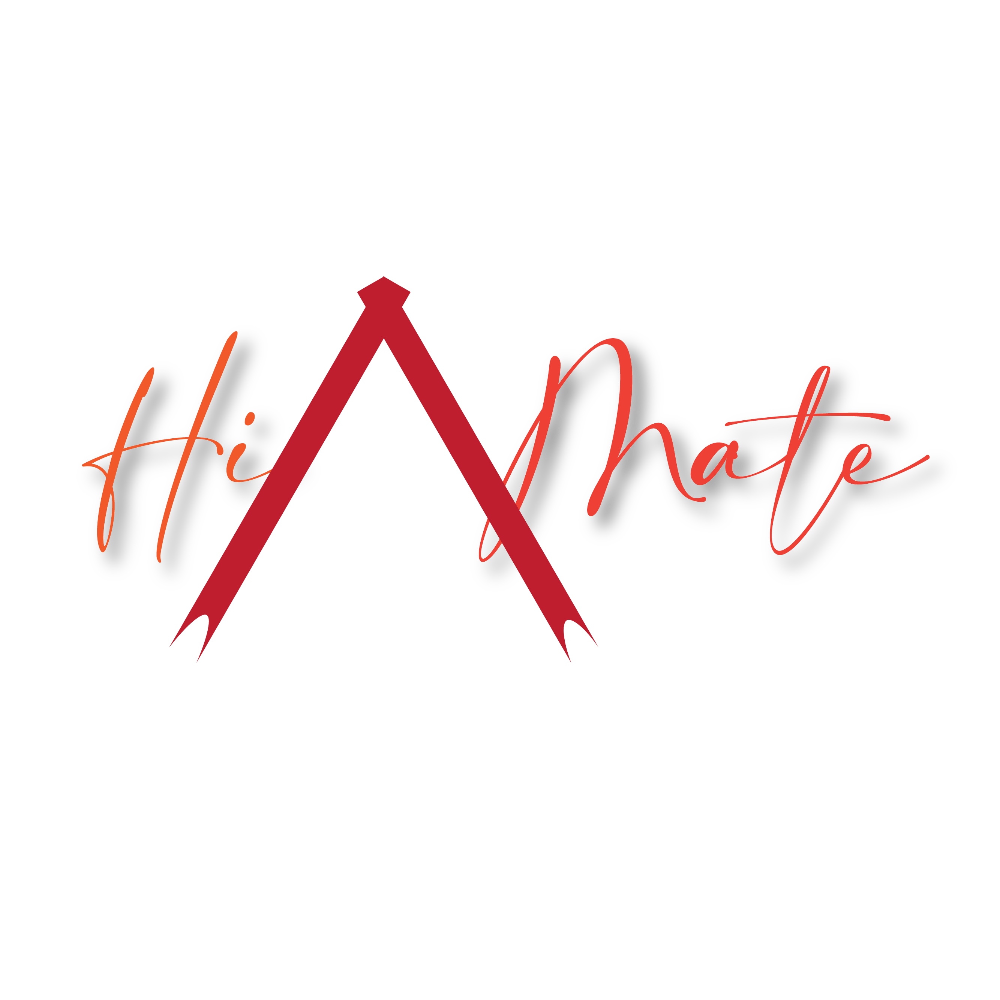

# **HiVMate**  
🌟 **Pengembangan Model Text Generation dengan Transformer untuk Pemantauan dan Edukasi HIV/AIDS** 🌟  

  

## **Tentang Proyek Ini**  
HiVMate adalah aplikasi berbasis *deep learning* yang menggunakan model Transformer untuk menghasilkan teks edukatif terkait HIV/AIDS. Proyek ini bertujuan untuk memberikan pemahaman yang mendalam, akurat, dan berbasis data tentang HIV/AIDS, serta meningkatkan kesadaran masyarakat.  

---

## **Fitur Utama**  
- 💡 **Informasi Komprehensif**: Menyediakan data dan jawaban berbasis fakta tentang berbagai aspek HIV/AIDS.  
- 🔍 **Kategori Informasi Berdasarkan Intent**: Termasuk pencegahan, pengobatan, epidemiologi, teknologi, dan lainnya.  
- 🤖 **Model AI Canggih**: Menggunakan Transformer untuk menghasilkan respons yang relevan dan mendalam.  
- 📱 **Akses Mudah**: Platform berbasis web untuk semua pengguna.  

---

## **Dataset**  
Dataset ini dikelompokkan berdasarkan berbagai *intent* untuk menjawab pertanyaan umum dan memberikan jawaban berdasarkan analisis mendalam.  

### **Kategori Intent**  
- **Informasi Dasar**  
- **Pencegahan**  
- **Diagnostik**  
- **Pengobatan**  
- **Penularan**  
- **Epidemiologi**  
- **Edukasi dan Kesadaran Masyarakat**  
- **Teknologi dan Inovasi dalam Penanganan HIV**  
- *(dan lainnya)*  

Struktur dataset meliputi pertanyaan (`text`) dan jawaban (`responses`) yang relevan dengan setiap *intent*.  

---

## **Flowchart Proses Pengembangan**  
  

---

## **Tautan Penting**  
- 🌐 **Aplikasi HiVMate**: [HiVMate](https://2zxeyainqmusivc5ttnpcy.streamlit.app/)  
- 📚 **Dokumentasi dan Catatan Proyek**: [Notion](https://organized-mandolin-c9d.notion.site/Deep-Learning-Kelompok-19-13232a2311c2809890ebca611ae2339b)  

---

## **Cara Menggunakan**  
1. Buka aplikasi melalui tautan di atas.  
2. Pilih kategori informasi yang diinginkan.  
3. Ajukan pertanyaan, dan dapatkan jawaban berbasis AI.  

---

## **Kontributor**  
👩‍💻 **Kelompok 19**  
- [Nama 1](https://github.com/Martinexe4)  
- [Nama 2](https://github.com/ARafiPrnggm)  
- [Nama 3](https://github.com/annisacahyanisurya)
- [Nama 4](https://github.com/devinaanin)
- [Nama 5](https://github.com/NadindaAurora)
- [Nama 6](https://github.com/silviaazahra)

---

## **Lisensi**  
Proyek ini dilisensikan di bawah [MIT License](LICENSE).  

